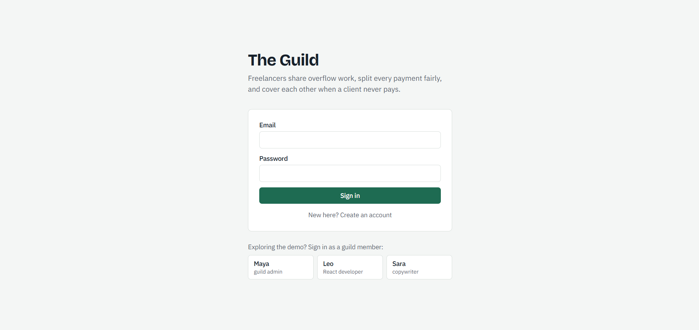
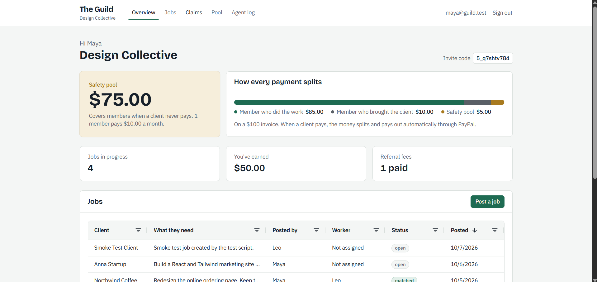
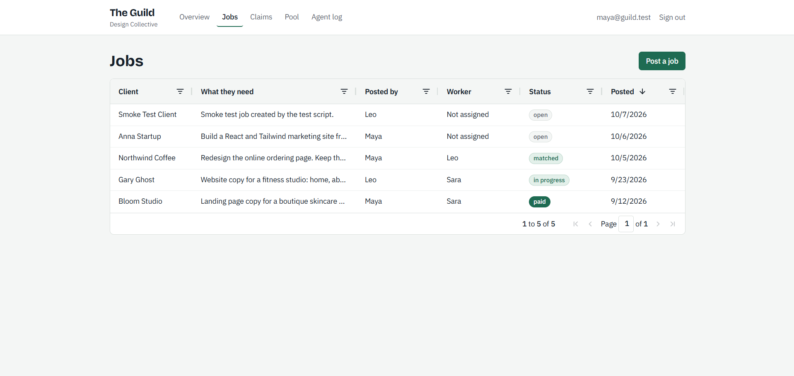
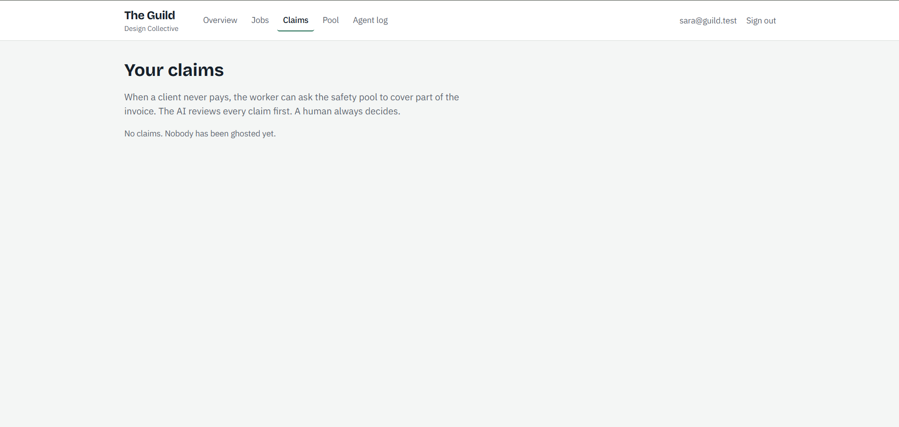

# The Guild

**Freelancers get the power of a company by acting like one.**

A small freelancer collective where an AI agent matches shared work, PayPal splits every payment automatically, and a group safety pool covers members when a client never pays.

**[Live demo](https://guild-frontend.mokshadsankhe.workers.dev)** · [API docs](https://guild-backend-vqg5.onrender.com/docs) · [Demo video](https://youtu.be/REPLACE)

## Screenshots

| | |
|---|---|
|  |  |
|  |  |

## The problem

Freelancers work alone. Companies have finance teams and lawyers. Freelancers have a group chat.

- Most freelancers have faced late or missing payments, and when a client ghosts, the freelancer absorbs the loss.
- Overflow work gets passed around informally, and the person who brought the client earns nothing.

## The solution

A guild of 10 to 50 freelancers pools work and money.

- Members post jobs they can't take. The AI picks the best member and explains why.
- When a client pays, the money splits automatically and pays out through PayPal.
- A slice of every payment, plus a small monthly fee, builds a **safety pool**.
- When a client never pays, the worker files a claim. The AI reviews it and flags risks. **A human admin always makes the final call.**

| Share | Goes to |
|---|---|
| 85% | the member who did the work |
| 10% | the member who brought the client |
| 5% | the safety pool |

With no referrer, the worker gets 95%.

## Try it in two minutes

Everything runs on PayPal sandbox with fake money. Open the [live demo](https://guild-frontend.mokshadsankhe.workers.dev) and use the demo buttons on the login page.

| Account | Role | Email | Password |
|---|---|---|---|
| Maya | Guild admin | `maya@guild.test` | `maya@123` |
| Leo | React developer | `leo@guild.test` | `leo@123` |
| Sara | Copywriter | `sara@guild.test` | `sara@123` |

1. **As Maya:** open **Anna Startup** and click **Match and assign**. Read why the AI chose that member.
2. **As Sara:** open **Gary Ghost**. The client hasn't paid in 10 days. Click **Client isn't paying** and file a claim.
3. **As Maya:** open **Claims**. Read the AI's verdict and red flags, then approve or reject. Going against the AI requires a written reason.
4. **Agent log:** every decision, tagged **AI**, **Rule**, or **Human**.

The backend sleeps when idle on the free tier. If the first page takes up to a minute, that's it waking up.

## Features

- **Guilds and members.** Create a guild, invite by code, set skills, rate, and availability.
- **AI job matching.** Scores members on skill fit, availability, and rate, and explains the choice.
- **Milestone invoicing.** Sends a real PayPal invoice per milestone with a pay link.
- **Automatic split payouts.** When an invoice is paid, one PayPal Payouts batch pays the worker and the referrer. The pool share stays in the guild account.
- **Safety pool.** Grows from invoice slices and a monthly PayPal subscription.
- **AI claim review.** Reads the member's statement, the agreed scope, the timeline, the member's history, and the listed evidence. Returns a verdict, a confidence score, reasons, and red flags.
- **Human approval.** Only an admin can release pool money. Overriding the AI requires a note, saved to the log.
- **Recovery.** If a ghost client pays later, the amount the pool covered is taken from the worker's share and returned to the pool. Nobody is paid twice.
- **Agent log.** Every AI suggestion, rule calculation, and human decision in plain words.

## PayPal products used

- **Invoicing:** milestone invoices with client pay links
- **Payouts:** one batch per paid invoice, plus claim payouts from the pool
- **Subscriptions:** monthly member contributions to the pool
- **Webhooks:** invoice paid, payout batch results, subscription status and payments, all signature-verified

## Safety and correctness

- **Cent-exact splits.** All money is stored as integer cents. Rounding leftovers go to the worker, so shares always add up.
- **No double payouts.** Invoice and claim rows are locked during payment, payout batches use stable IDs that PayPal won't accept twice, and pool credits are keyed to PayPal transaction IDs.
- **Verified webhooks.** Every webhook is checked with PayPal before it's trusted, and each event is processed once.
- **Webhook backup.** A sync action asks PayPal for the real status, in case a webhook was missed.
- **Pool rules.** A member waiting period, an overdue threshold, a 50% cap per claim, and a balance check before any payout.
- **The AI never moves money.** It suggests and explains. Rules calculate. Humans approve.

## How it's built

```
Next.js static site (Cloudflare Workers)
        │  Supabase login token
        ▼
FastAPI (Render)  ◄────  PayPal webhooks
        │
        ├── Supabase Postgres
        ├── Cloudflare Workers AI  (matching, claim review)
        └── PayPal  (Invoicing, Payouts, Subscriptions, Webhooks)
```

- **Frontend:** Next.js 16 (static export), Tailwind CSS v4, AG Grid Community, SWR, Supabase Auth
- **Backend:** FastAPI, SQLModel, Alembic, PostgreSQL
- **AI:** Cloudflare Workers AI (Llama 3.3 70B), validated with Pydantic and retried on bad JSON
- **Hosting:** Cloudflare Workers static assets, Render, Supabase
- **Automation:** GitHub Actions keeps the backend awake during judging

## Repo layout

```
backend/
  app/
    models.py        Database tables
    auth.py          Supabase token checks
    routers/         API routes
    services/        PayPal, AI, split engine, claims, pool
  alembic/           Database migrations
  scripts/           Smoke tests, end-to-end tests, demo reset
  tests/             Split engine unit tests
frontend/
  app/               Pages
  components/        UI, split bar, jobs grid, agent feed
.github/workflows/   Keep-awake job
```

## Run it locally

You need Python 3.11+, Node 20+, a Supabase project, a PayPal sandbox app, and a Cloudflare account with Workers AI.

```bash
# Backend
cd backend
python -m venv .venv
source .venv/bin/activate        # Windows: .venv\Scripts\Activate.ps1
pip install -r requirements.txt
cp .env.example .env             # fill in your keys
alembic upgrade head
uvicorn app.main:app --reload

# Frontend, in a new terminal
cd frontend
npm install
cp .env.local.example .env.local # fill in your keys
npm run dev
```

Open http://localhost:3000. Run the split engine tests with `cd backend && pytest -v`.

## About the demo data

The demo guild is seeded with a short history so it doesn't start empty: one paid job and a founding contribution to the pool. Every action you take in the demo, including matching, invoicing, paying, claiming, and approving, runs live against PayPal sandbox and Workers AI.

## What's next

- Smart late payment reminders that escalate politely
- Scope creep detection with one-click add-on invoices
- Deposits held with PayPal Orders until work is delivered

## License

MIT. See [LICENSE](LICENSE).

Built for the PayPal AI Hackathon, 2026.